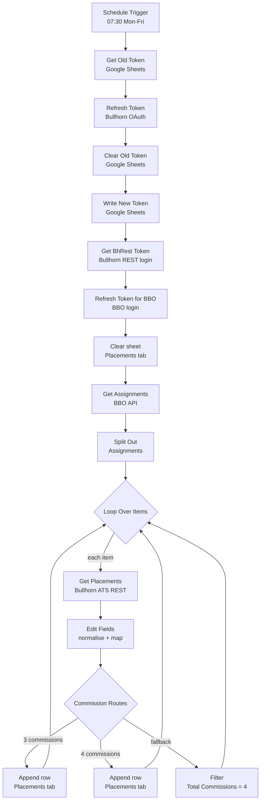

# Bullhorn Placement & Commission Split Sync (n8n)

An n8n workflow that automatically pulls placement and commission-split data from **Bullhorn Back Office (BBO)** and **Bullhorn ATS**, flattens it into one row per placement, and refreshes a **Google Sheet** every weekday morning. The sheet feeds downstream pivot tables and gross-margin reporting.

---

## Table of Contents

- [Why this exists](#why-this-exists)
- [How it works](#how-it-works)
- [Workflow diagram](#workflow-diagram)
- [Node-by-node breakdown](#node-by-node-breakdown)
- [Commission routing logic](#commission-routing-logic)
- [Output: Google Sheet schema](#output-google-sheet-schema)
- [Tech stack](#tech-stack)
- [Prerequisites](#prerequisites)
- [Setup](#setup)
- [Configuration reference](#configuration-reference)
- [Schedule](#schedule)
- [Known limitations](#known-limitations)
- [Security notes](#security-notes)
- [Repository structure](#repository-structure)
- [License](#license)

---

## Why this exists

Staffing firms tracking gross margin need to know **which recruiters/reps earn what share of each placement**. In Bullhorn, that commission-split data lives per placement and can't be pulled out of the standard canned reports in a usable, joinable shape.

This workflow replaces a manual daily export-and-paste process with a fully automated one:

- Pulls every assignment from BBO
- Enriches each one with placement, candidate, client, and commission details from the Bullhorn ATS REST API
- Writes a wide-format table (one row per placement, up to 4 reps as columns) into Google Sheets
- Runs unattended on a schedule, including its own OAuth token rotation

---

## How it works

1. **Schedule Trigger** fires at 07:30 on weekdays.
2. **Token rotation:** the stored Bullhorn refresh token is read from a `Token` tab in Google Sheets, exchanged for a new access token + refresh token, and the new refresh token is written back to the sheet for the next run.
3. **Session setup:** a Bullhorn REST session (`BhRestToken`) and a BBO session token are obtained.
4. **Full refresh:** the `Placements` tab is cleared (header row kept).
5. **Fetch assignments** from the BBO API and split them into individual items.
6. **Loop over each assignment:** fetch the matching Placement entity from the Bullhorn ATS REST API (candidate, owner, job order, client, employment type, status, dates, commissions).
7. **Normalise fields** (names as `Last, First`, percentages, ISO dates, rep 1-4 roles and splits).
8. **Route by number of commission splits** (3 or 4) and append the row to the `Placements` tab.
9. Loop until every assignment is processed.

---

## Workflow diagram



---

## Node-by-node breakdown

| # | Node | Type | What it does |
|---|------|------|--------------|
| 1 | **Schedule Trigger** | Schedule | Cron `0 30 7 * * 1-5`, weekdays at 07:30 (instance timezone). |
| 2 | **Get Old Token** | Google Sheets (read) | Reads the current Bullhorn refresh token from the `Token` tab (column `Refresh token`). |
| 3 | **Refresh Token** | HTTP Request | `POST auth-east.bullhornstaffing.com/oauth/token` with `grant_type=refresh_token`. Returns a new `access_token` and `refresh_token`. |
| 4 | **Clear Old Token** | Google Sheets (clear) | Clears the `Token` tab, keeping the header row. |
| 5 | **Write New Token** | Google Sheets (append) | Stores the new refresh token for the next run. |
| 6 | **Get BhRest Token** | HTTP Request | `POST rest-east.bullhornstaffing.com/rest-services/login` using the fresh `access_token`. Returns `BhRestToken` and `restUrl`. |
| 7 | **Refresh Token for BBO** | HTTP Request | `POST api.bbo.bullhornstaffing.com/v1.0/Login` to obtain a BBO API token. |
| 8 | **Clear sheet** | Google Sheets (clear) | Clears the `Placements` tab (header kept) so each run is a full refresh. |
| 9 | **Get Assignments** | HTTP Request | `GET api.bbo.bullhornstaffing.com/v1.0/Assignments` with the BBO token and vanity name. |
| 10 | **Split Out** | Split Out | Splits the `Assignments` array into one item per assignment. |
| 11 | **Loop Over Items** | Split In Batches | Iterates one assignment at a time. |
| 12 | **Get Placements** | HTTP Request | `GET {restUrl}entity/Placement/{integrationId}` with the field list below. |
| 13 | **Edit Fields** | Set | Builds the flat record (names, dates, employment type, status, Rep 1-4, roles, commission %). |
| 14 | **Commission Routes** | Switch | Routes by `Total Commissions`: `3`, `4`, or fallback. |
| 15 | **Append row in sheet2 / sheet3** | Google Sheets (append) | Writes the row for the 3-commission or 4-commission case. |
| 16 | **Filter** | Filter | Fallback branch: passes items only where `Total Commissions = 4`. |

**Placement fields requested from Bullhorn ATS:**

```
id, owner(firstName,lastName), candidate(firstName,lastName), dateAdded, dateEnd,
employmentType, status, payRate, clientBillRate, overtimeRate, clientOvertimeRate,
customPayRate1, customBillRate1, jobOrder(title), clientCorporation(name),
commissions(commissionPercentage,role,user(firstName,lastName))
```

**Values taken from each BBO assignment:** `integrationId` (used as the Bullhorn Placement ID), `startDate`, `prospectiveEndPeriod`.

---

## Commission routing logic

Each placement can have several commission recipients. The **Commission Routes** switch sends each record down one path based on `Total Commissions`:

| Output | Condition | Result |
|--------|-----------|--------|
| `3 Commissions` | `Total Commissions == 3` | Row appended with Rep 1-3 |
| `4 Commissions` | `Total Commissions == 4` | Row appended with Rep 1-4 |
| Fallback | anything else | Sent to the `Filter` node (see [Known limitations](#known-limitations)) |

> **Column ordering note:** in the output sheet, `Rep1` is populated from the *third* commission entry returned by Bullhorn and `Rep3` from the *first*. `Rep2` and `Rep4` map straight through. This reversal is intentional in the current build so the sheet matches the reporting layout. Adjust the mappings in the two Append nodes if your layout differs.

---

## Output: Google Sheet schema

The workflow writes to a Google Sheet that feeds gross-margin pivot tables and reports. Sample output (names and companies redacted):


The workflow expects a spreadsheet with **two tabs**.

### Tab: `Token`

| Refresh token |
|---------------|
| *(current Bullhorn refresh token; managed by the workflow)* |

Seed this tab once with a valid refresh token before the first run.

### Tab: `Placements`

Header row (must exist; the workflow keeps it when clearing):

```
Placement | Company | Job Title | Owner | Placement Type | Status | Candidate |
Date Added | Start Date | End Date |
Rep1 | Comm Role1 | Rep1 % |
Rep2 | Comm Role2 | Rep2 % |
Rep3 | Comm Role3 | Rep3 % |
Rep4 | Comm Role4 | Rep4 % |
Check
```

| Column | Source |
|--------|--------|
| Placement | Bullhorn Placement `id` |
| Company | `clientCorporation.name` |
| Job Title | `jobOrder.title` |
| Owner | `owner` as `Last, First` |
| Placement Type | `employmentType` |
| Status | `status` |
| Candidate | `candidate` as `Last, First` |
| Date Added | `dateAdded` (formatted `YYYY-MM-DD`) |
| Start Date | BBO assignment `startDate` |
| End Date | Placement `dateEnd` (formatted `YYYY-MM-DD`) |
| Rep N / Comm Role N / Rep N % | `commissions.data[]` user, role, and `commissionPercentage x 100` |
| Check | Static `100.00%` (sanity column for downstream sheet validation) |

---

## Tech stack

- **n8n** (workflow automation)
- **Bullhorn ATS REST API** (OAuth 2.0, `rest-east`)
- **Bullhorn Back Office (BBO) API** (`api.bbo.bullhornstaffing.com/v1.0`)
- **Google Sheets API** (via n8n Google Sheets OAuth2 credential)

---

## Prerequisites

- An n8n instance (cloud or self-hosted)
- Bullhorn ATS API access: a **Client ID**, **Client Secret**, and a valid **refresh token**
- Bullhorn Back Office API access: a BBO **username**, **password**, and **vanity name**
- A Google account with access to the target spreadsheet
- The Bullhorn data center for your account (the workflow is built for the **East** cluster, see [Configuration reference](#configuration-reference))

---

## Setup

### 1. Clone the repo

```bash
git clone https://github.com/<your-username>/<your-repo>.git
cd <your-repo>
```

### 2. Prepare the Google Sheet

Create a spreadsheet with the `Token` and `Placements` tabs described in [Output: Google Sheet schema](#output-google-sheet-schema). Paste your current Bullhorn refresh token under the `Refresh token` header in the `Token` tab.

### 3. Import the workflow

In n8n: **Workflows -> Import from File** -> select `workflows/placement-flow.json`.

### 4. Create credentials in n8n

| Credential | Used by |
|------------|---------|
| **Google Sheets OAuth2** | Get Old Token, Clear Old Token, Write New Token, Clear sheet, both Append nodes |
| **OAuth2 API** (Bullhorn) | Get BhRest Token |

Re-select the credential on each node that shows a warning after import.

### 5. Replace the placeholders

The exported workflow contains placeholders instead of real values. Replace each one:

| Placeholder | Where | Replace with |
|-------------|-------|--------------|
| `YOUR_BULLHORN_CLIENT_ID` | Refresh Token node | Your Bullhorn API client ID |
| `YOUR_BULLHORN_CLIENT_SECRET` | Refresh Token node | Your Bullhorn API client secret |
| `YOUR_BBO_USERNAME` | Refresh Token for BBO node (JSON body) | BBO API username |
| `YOUR_BBO_PASSWORD` | Refresh Token for BBO node (JSON body) | BBO API password |
| `YOUR_BBO_VANITY_NAME` | Refresh Token for BBO and Get Assignments nodes | Your BBO vanity name |
| `YOUR_GOOGLE_SHEET_ID` | All Google Sheets nodes | ID from your sheet URL (`/d/<ID>/edit`) |

Also re-pick the **Document** and **Sheet** in each Google Sheets node (`Token` / `Placements`) so the tab IDs match your spreadsheet.

### 6. Test, then publish

Run the workflow manually once, confirm the `Placements` tab fills correctly and the `Token` tab holds a new refresh token, then **publish** the workflow.

---

## Configuration reference

| Setting | Location | Default |
|---------|----------|---------|
| Schedule | Schedule Trigger | `0 30 7 * * 1-5` (07:30, Mon-Fri) |
| Bullhorn OAuth host | Refresh Token node | `auth-east.bullhornstaffing.com` |
| Bullhorn REST login host | Get BhRest Token node | `rest-east.bullhornstaffing.com` |
| Session TTL | Get BhRest Token node | `480` minutes |
| BBO API base | Refresh Token for BBO / Get Assignments | `api.bbo.bullhornstaffing.com/v1.0` |
| Placement fields | Get Placements node (`fields` param) | See [Node-by-node breakdown](#node-by-node-breakdown) |

If your Bullhorn account is not on the East data center, update the OAuth and REST login hosts accordingly.

---

## Schedule

The workflow runs at **07:30 on weekdays** in the n8n instance's timezone (set under **Settings -> Workflow -> Timezone** or the instance default). Change the cron expression in the Schedule Trigger node to adjust.

---

## Known limitations

These are observations from the current build, worth reviewing before relying on it for edge cases:

- **Only 3 and 4-commission placements are written.** Placements with any other number of commission splits go to the fallback output, which feeds the `Filter` node. That filter only passes `Total Commissions = 4`, so fallback items are dropped and never return to the loop. Depending on n8n's batching behaviour this can end the loop early. If your data includes 1, 2, 5, or 6-rep placements, add matching Switch outputs or route the fallback straight back to `Loop Over Items`.
- **Up to 4 reps supported.** The Edit Fields node reads `commissions.data[0]` to `[3]` only.
- **Full refresh each run.** The `Placements` tab is cleared at the start. If the run fails midway, the sheet will be partially filled until the next successful run.
- **Token rotation is not atomic.** The refresh token is cleared and then rewritten. If a run fails between *Clear Old Token* and *Write New Token*, the stored token can be lost and must be re-seeded manually.
- **`Check` is a static value** (`100.00%`), not a calculated total of the rep percentages.
- **Sequential processing.** One placement lookup per item, so runtime grows with the number of assignments.

---

## Security notes

- **Never commit real credentials.** The workflow JSON in this repo has been sanitized. Do not re-export from n8n and commit it without scrubbing client IDs/secrets, BBO username/password, vanity name, spreadsheet IDs, and credential IDs.
- Prefer **n8n credentials** (or environment variables) over hardcoding secrets in HTTP Request nodes.
- Rotate any secret that was ever pasted into a workflow export or committed to Git history.
- Sheet data contains candidate and employee names and commission splits. Restrict spreadsheet sharing accordingly.

---

## Repository structure

```
.
├── README.md
├── docs/
│   ├── workflow-overview.png      # n8n canvas screenshot
│   └── sheet-output-sample.png    # Placements tab output (redacted)
└── workflows/
    └── placement-flow.json        # sanitized n8n workflow export
```

---

## License

Add a license of your choice (for example MIT) as `LICENSE` in the repo root.
